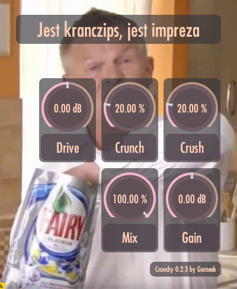

# crunchy
An audio effect plugin in rust, using nih_plug. Clips and bitcrushes DCT coefficients of the soundwave, resulting in either raw, mostly high-pitched screaming sound, or weird wobbly effect somewhat similiar to reducing bitrate in mp3 files. 

# Compiling
Run
``cargo xtask bundle crunchy-plugin --release``
in project root

# Parameters
- **Drive** - gain applied before other effects
- **Crunch** - clips DCT coefficients of input, removing most lower frequencies and resulting in a sound similar to a more traditional distortion
- **Crush** - bitcrushes DCT coefficients, removing detail from the sound while also producing artifacts
- **Mix** - proportion of dry to wet signal
- **Gain** - gain applied after everything else
